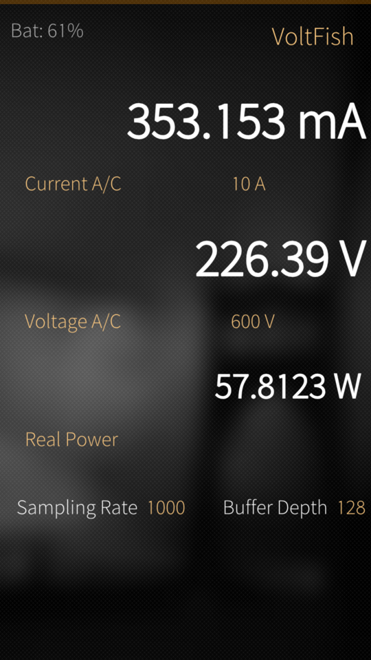
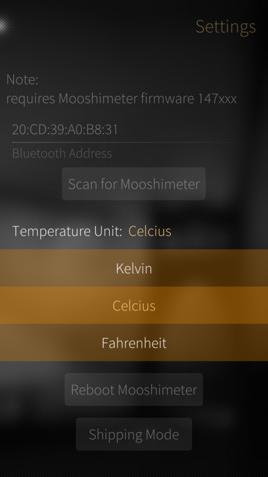

# VoltFish
[SailfishOS](https://sailfishos.org/) app for the [Mooshimeter](https://moosh.im/mooshimeter/) BluetoothLE Multimeter based on [pk8's mooshimeter lib](https://github.com/pk8/mooshimeter-lib).

This app is in early alpha stage, and has only been tested in my phone (Aquafish) with my meter, so expect plenty of bugs :)

**To use the app, you must enter the Bluetooth ID of your Mooshimeter in the app's settings dialog. Currently only 147xxx series firmware is supported, 152xxx does not work.**

## What works:
* scan for and connect to Mooshimeter
* display basic readings
* select input channels and ranges
* "math" channel (power calculations and K-Thermocouple)
* battery level indicator
* temperature unit conversion (Celcius / Kelvin / Fahrenheit)

## What doesn't work:
* logging is not yet supported
* there are no pretty graphs (not even ugly ones)
* proper connection handling (disconnects/reconnect)
* probably a lot of other features I can't think of right now :)

## Known bugs:
* app sometimes fails to connect to Mooshimeter at startup and becomes unresponsive

## Screenshots:

## Licence:

This program is free software; you can redistribute it and/or modify
it under the terms of the GNU General Public License as published by
the Free Software Foundation; either version 2 of the License, or
(at your option) any later version.

This program is distributed in the hope that it will be useful,
but WITHOUT ANY WARRANTY; without even the implied warranty of
MERCHANTABILITY or FITNESS FOR A PARTICULAR PURPOSE.  See the
GNU General Public License for more details.

You should have received a copy of the GNU General Public License
along with this program; if not, write to the Free Software
Foundation, Inc., 51 Franklin St, Fifth Floor, Boston, MA  02110-1301  USA

## 3rd party code:

* src/lib: https://github.com/pk8/mooshimeter-lib
* qml/lib/ScreenBlank.qml: https://github.com/jgibbon/slumber (GPL2)
* include/bluetooth: http://www.bluez.org/ (GPL2)

